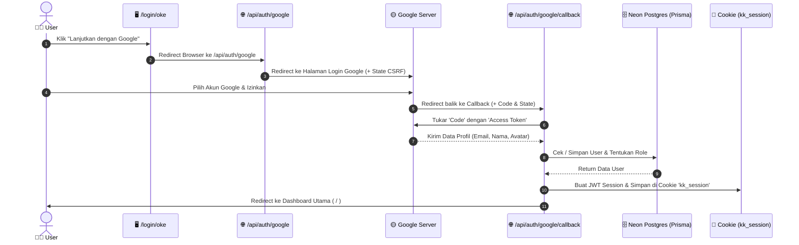
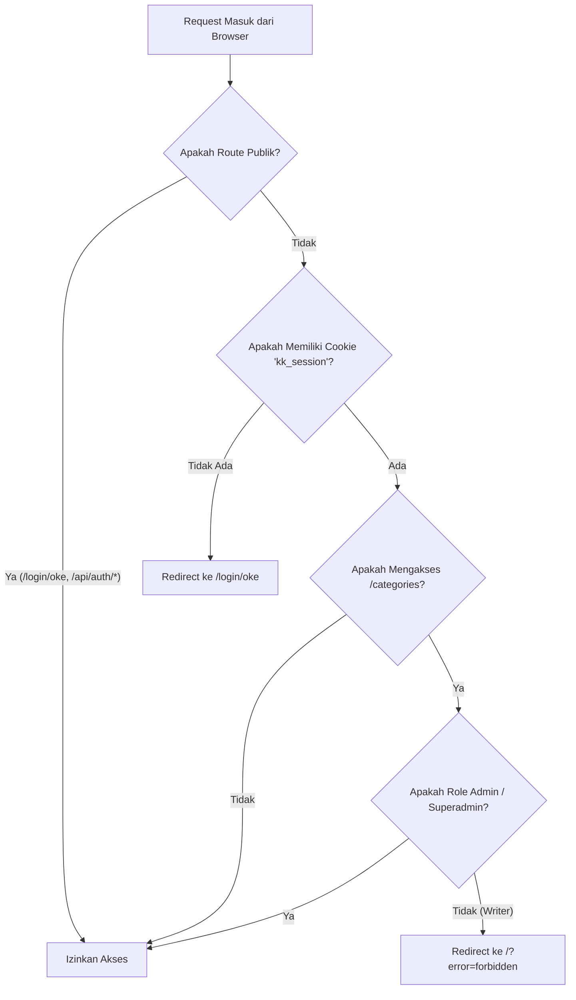

# 🔐 Dokumentasi Panduan Belajar: Login Google OAuth & Hak Akses (RBAC) di Next.js 16

Dokumentasi ini dibuat khusus untuk membantu Anda memahami aliran kerja (flow), struktur file, dan penjelasan kode baris-demi-baris dibalik fitur **Login Google OAuth 2.0** dan **Hak Akses (Role-Based Access Control / RBAC)** pada aplikasi KataKata.

---

## 📌 1. Konsep Utama & Arsitektur

Fitur otentikasi ini dibangun **tanpa library Pihak Ke Tiga seperti NextAuth/Clerk**, menggunakan standar bawaan **Next.js 16 (App Router)** dan JWT (`jose`).

### Peta Peran (Role System):

1. **`superadmin`**: Akses penuh ke seluruh halaman (Termasuk `/categories`).
2. **`admin`**: Akses penuh ke seluruh halaman (Termasuk `/categories`).
3. **`writer`**: Akses halaman umum (Dashboard, Quotes, Authors). **DILARANG** mengakses `/categories`.

### Aturan Role Otomatis saat Pertama Login:

- Email `bidang3.habibrifqi@gmail.com` jika **belum ada di database** akan otomatis mendapat role **`superadmin`**.
- Email lain jika **belum ada di database** akan otomatis mendapat role **`writer`**.
- Jika email **sudah ada di database**, sistem akan menggunakan role yang sudah tersimpan di database.

---

## 📁 2. Struktur File & Perannya

```text
src/
├── lib/
│   ├── session.js             # 🔑 Mengelola JWT (Encrypt, Decrypt, Set/Delete Cookie)
│   └── useCurrentUser.js      # 🪝 Hook React untuk mengambil data user di komponen Client
├── proxy.js                    # 🛡️ Proxy Server (Next.js 16) untuk memproteksi Route & Role
├── app/
│   ├── login/oke/page.jsx     # 🎨 Halaman Login dengan tombol Google
│   ├── categories/
│   │   ├── page.jsx           # 🔒 Server Guard (Proteksi ganda halaman Categories)
│   │   └── CategoriesClient.jsx # 🎨 Komponen UI Categories
│   └── api/auth/
│       ├── google/
│       │   └── route.js       # 🚀 Inisiasi Login (Redirect user ke Google)
│       ├── google/callback/
│       │   └── route.js       # 🔄 Menerima hasil login dari Google & simpan ke DB
│       ├── logout/
│       │   └── route.js       # 🚪 Logout user (Hapus cookie)
│       └── me/
│           └── route.js       # 👤 API untuk ambil info user yang sedang login
```

---

## 🔄 3. Alur Kerja (Flow Diagram)

### 🅰️ Alur Proses Login (Google OAuth)



---

### 🅱️ Alur Satpam Route (`proxy.js`)



---

## 💻 4. Penjelasan Kode Lengkap (Line-by-Line / Baris per Baris)

Di bawah ini adalah penjelasan kode lengkap untuk setiap file otentikasi di aplikasi ini:

---

### 1. `src/lib/session.js` (Helper JWT & Cookie)

File ini bertugas mengacak data user menjadi token rahasia (JWT) dan menyimpannya di cookie browser.

```javascript
import "server-only"; // Memastikan file ini HANYA bisa dijalankan di Server, tidak akan bocor ke Client
import { SignJWT, jwtVerify } from "jose"; // Library JWT yang aman & ringan untuk Next.js
import { cookies } from "next/headers"; // API Next.js untuk membaca & menulis Cookie

const SESSION_COOKIE_NAME = "kk_session"; // Nama cookie yang disimpan di browser
const SESSION_DURATION_MS = 7 * 24 * 60 * 60 * 1000; // Masa berlaku cookie: 7 hari (dalam milidetik)

// Fungsi pembantu untuk mengambil Kunci Rahasia dari .env.local
function getSecretKey() {
  const secret = process.env.SESSION_SECRET;
  if (!secret) {
    throw new Error("SESSION_SECRET environment variable is not set");
  }
  return new TextEncoder().encode(secret); // Mengubah string secret menjadi format Uint8Array
}

// ─── 1. Encrypt (Mengubah data user menjadi JWT String) ───────────────────────
export async function encrypt(payload) {
  return new SignJWT(payload)
    .setProtectedHeader({ alg: "HS256" }) // Menggunakan algoritma enkripsi HS256
    .setIssuedAt() // Waktu token dibuat
    .setExpirationTime("7d") // Token kadaluarsa dalam 7 hari
    .sign(getSecretKey()); // Menandatangani token dengan secret key
}

// ─── 2. Decrypt (Membaca JWT String menjadi objek data user kembali) ─────────
export async function decrypt(token) {
  try {
    const { payload } = await jwtVerify(token, getSecretKey(), {
      algorithms: ["HS256"],
    });
    return payload; // Mengembalikan data user jika token valid
  } catch {
    return null; // Jika token rusak/diubah orang lain, kembalikan null (gagal)
  }
}

// ─── 3. Buat Session Baru (Diakses saat Login Berhasil) ──────────────────────
export async function createSession({ userId, role, name, email, image }) {
  const expiresAt = new Date(Date.now() + SESSION_DURATION_MS);

  // Buat JWT Token dari data user
  const token = await encrypt({
    userId,
    role,
    name,
    email,
    image,
    expiresAt: expiresAt.toISOString(),
  });

  // Simpan token di Cookie Browser
  const cookieStore = await cookies();
  cookieStore.set(SESSION_COOKIE_NAME, token, {
    httpOnly: true, // PENTING: JavaScript browser tidak bisa membaca cookie ini (Aman dari XSS)
    secure: process.env.NODE_ENV === "production", // Wajib HTTPS saat Production
    expires: expiresAt,
    sameSite: "lax",
    path: "/", // Cookie berlaku di seluruh halaman situs
  });
}

// ─── 4. Ambil Session User dari Cookie ───────────────────────────────────────
export async function getSession() {
  const cookieStore = await cookies();
  const token = cookieStore.get(SESSION_COOKIE_NAME)?.value;
  if (!token) return null;
  return decrypt(token);
}

// ─── 5. Hapus Session (Logout) ───────────────────────────────────────────────
export async function deleteSession() {
  const cookieStore = await cookies();
  cookieStore.delete(SESSION_COOKIE_NAME);
}
```

---

### 2. `src/app/api/auth/google/route.js` (Mengarahkan ke Google)

Endpoint ini dipanggil saat user mengklik tombol **"Lanjutkan dengan Google"**.

```javascript
import { NextResponse } from "next/server";

// GET /api/auth/google
export async function GET() {
  const clientId = process.env.GOOGLE_CLIENT_ID;
  const appUrl = process.env.NEXT_PUBLIC_APP_URL || "http://localhost:3000";
  const redirectUri = `${appUrl}/api/auth/google/callback`; // URL tujuan setelah dari Google

  // Generate string acak (state) untuk mencegah serangan hacker CSRF
  const state = crypto.randomUUID();

  // Menyusun parameter query yang dibutuhkan oleh Google OAuth 2.0
  const params = new URLSearchParams({
    client_id: clientId,
    redirect_uri: redirectUri,
    response_type: "code",
    scope: "openid email profile", // Data yang kita minta: ID, Email, dan Profil Nama/Avatar
    state,
    access_type: "online",
    prompt: "select_account", // Selalu munculkan layar pilih akun Google
  });

  const googleAuthUrl = `https://accounts.google.com/o/oauth2/v2/auth?${params.toString()}`;

  // Redirect browser user ke halaman login Google
  const response = NextResponse.redirect(googleAuthUrl);

  // Simpan 'state' sementara di Cookie selama 10 menit untuk dicek nanti
  response.cookies.set("oauth_state", state, {
    httpOnly: true,
    secure: process.env.NODE_ENV === "production",
    maxAge: 60 * 10, // 10 menit
    sameSite: "lax",
    path: "/",
  });

  return response;
}
```

---

### 3. `src/app/api/auth/google/callback/route.js` (Callback & Penyimpanan DB)

File ini adalah tempat paling krusial di mana pertukaran token, pendaftaran user ke Database, dan penentuan **Role** terjadi.

```javascript
import { NextResponse } from "next/server";
import { prisma } from "@/lib/prisma";
import { createSession } from "@/lib/session";

const SUPERADMIN_EMAIL = "bidang3.habibrifqi@gmail.com";
const LOGIN_PAGE = "/login/oke";

// GET /api/auth/google/callback
export async function GET(request) {
  const { searchParams } = new URL(request.url);
  const code = searchParams.get("code"); // Kode otorisasi dari Google
  const state = searchParams.get("state"); // Kode acak CSRF dari Google
  const error = searchParams.get("error"); // Jika user klik 'Cancel'

  if (error) {
    return NextResponse.redirect(
      new URL(`${LOGIN_PAGE}?error=google_cancelled`, request.url),
    );
  }

  if (!code || !state) {
    return NextResponse.redirect(
      new URL(`${LOGIN_PAGE}?error=invalid_callback`, request.url),
    );
  }

  // 1. Verifikasi Keamanan CSRF (State di URL harus cocok dengan State di Cookie)
  const storedState = request.cookies.get("oauth_state")?.value;
  if (!storedState || storedState !== state) {
    return NextResponse.redirect(
      new URL(`${LOGIN_PAGE}?error=invalid_state`, request.url),
    );
  }

  // 2. Tukar 'code' dengan 'access_token' resmi ke server Google
  const appUrl = process.env.NEXT_PUBLIC_APP_URL || "http://localhost:3000";
  const redirectUri = `${appUrl}/api/auth/google/callback`;

  let googleTokens;
  try {
    const tokenRes = await fetch("https://oauth2.googleapis.com/token", {
      method: "POST",
      headers: { "Content-Type": "application/x-www-form-urlencoded" },
      body: new URLSearchParams({
        code,
        client_id: process.env.GOOGLE_CLIENT_ID,
        client_secret: process.env.GOOGLE_CLIENT_SECRET,
        redirect_uri: redirectUri,
        grant_type: "authorization_code",
      }),
    });
    googleTokens = await tokenRes.json();
  } catch {
    return NextResponse.redirect(
      new URL(`${LOGIN_PAGE}?error=token_exchange_failed`, request.url),
    );
  }

  // 3. Ambil data profil user dari Google menggunakan access_token
  let googleUser;
  try {
    const userRes = await fetch(
      "https://www.googleapis.com/oauth2/v2/userinfo",
      {
        headers: { Authorization: `Bearer ${googleTokens.access_token}` },
      },
    );
    googleUser = await userRes.json();
  } catch {
    return NextResponse.redirect(
      new URL(`${LOGIN_PAGE}?error=userinfo_failed`, request.url),
    );
  }

  // 4. Logika Penentuan Role & Simpan ke Database (Prisma)
  let dbUser;
  try {
    // Cek apakah user sudah terdaftar di database
    const existingUser = await prisma.user.findUnique({
      where: { email: googleUser.email },
    });

    if (existingUser) {
      // User SUDAH ADA ➔ Update nama & gambar avatar, PERTAHANKAN ROLE LAMA dari DB
      dbUser = await prisma.user.update({
        where: { email: googleUser.email },
        data: {
          name: googleUser.name,
          image: googleUser.picture,
        },
      });
    } else {
      // User BELUM ADA ➔ Tentukan Role baru
      const newRole =
        googleUser.email === SUPERADMIN_EMAIL ? "superadmin" : "writer";

      // Simpan User Baru ke Database
      dbUser = await prisma.user.create({
        data: {
          name: googleUser.name,
          email: googleUser.email,
          image: googleUser.picture,
          role: newRole,
        },
      });
    }
  } catch (err) {
    console.error("[Auth Callback] DB error:", err);
    return NextResponse.redirect(
      new URL(`${LOGIN_PAGE}?error=db_error`, request.url),
    );
  }

  // 5. Buat JWT Cookie Session untuk browser user
  await createSession({
    userId: dbUser.id,
    role: dbUser.role,
    name: dbUser.name,
    email: dbUser.email,
    image: dbUser.image,
  });

  // 6. Hapus cookie sementara oauth_state & redirect user ke Dashboard ( / )
  const response = NextResponse.redirect(new URL("/", request.url));
  response.cookies.delete("oauth_state");

  return response;
}
```

---

### 4. `src/proxy.js` (Satpam Penjaga Halaman / Route Protection Next.js 16)

File `proxy.js` adalah fitur resmi Next.js 16 (pengganti `middleware.ts`) yang berjalan sebelum halaman sempat dimuat.

```javascript
import { NextResponse } from "next/server";
import { decrypt } from "@/lib/session";

const LOGIN_PAGE = "/login/oke";

// Daftar halaman bebas diakses tanpa perlu login
const PUBLIC_ROUTES = [
  "/login/oke",
  "/api/auth/google",
  "/api/auth/google/callback",
];

// Daftar halaman khusus Admin & Superadmin
const ADMIN_ONLY_ROUTES = ["/categories"];

export async function proxy(request) {
  const { pathname } = request.nextUrl;

  // Cek apakah halaman yang dibuka adalah halaman publik
  const isPublicRoute =
    PUBLIC_ROUTES.some((r) => pathname === r || pathname.startsWith(r)) ||
    pathname.startsWith("/api/auth/");

  // Baca & Dekripsi Cookie Session
  const sessionToken = request.cookies.get("kk_session")?.value;
  const session = sessionToken ? await decrypt(sessionToken) : null;

  // ATURAN 1: Jika belum login & mencoba buka halaman terproteksi ➔ Lempar ke /login/oke
  if (!isPublicRoute && !session) {
    return NextResponse.redirect(new URL(LOGIN_PAGE, request.url));
  }

  // ATURAN 2: Jika SUDAH login & mencoba buka halaman /login/oke ➔ Lempar ke Dashboard ( / )
  if (pathname === LOGIN_PAGE && session) {
    return NextResponse.redirect(new URL("/", request.url));
  }

  // ATURAN 3 (RBAC): Cek jika membuka /categories
  const isAdminOnlyRoute = ADMIN_ONLY_ROUTES.some(
    (r) => pathname === r || pathname.startsWith(r + "/"),
  );

  if (isAdminOnlyRoute && session) {
    const allowedRoles = ["admin", "superadmin"];
    // Jika role user adalah 'writer', TOLAK AKSES!
    if (!allowedRoles.includes(session.role)) {
      return NextResponse.redirect(new URL("/?error=forbidden", request.url));
    }
  }

  return NextResponse.next(); // Izinkan akses lanjut
}

// Konfigurasi agar proxy berjalan di seluruh route (kecuali file gambar/css statis)
export const config = {
  matcher: [
    "/((?!_next/static|_next/image|favicon.ico|sitemap.xml|robots.txt).*)",
  ],
};
```

---

### 5. `src/app/api/auth/me/route.js` (Endpoint Info User Login)

Endpoint ringkas ini dipakai oleh komponen tampilan (Client Components) untuk tahu siapa user yang sedang login.

```javascript
import { NextResponse } from "next/server";
import { getSession } from "@/lib/session";

// GET /api/auth/me
export async function GET() {
  const session = await getSession();

  // Jika tidak ada session (belum login)
  if (!session) {
    return NextResponse.json({ user: null }, { status: 401 });
  }

  // Kembalikan data user publik tanpa menyertakan secret key
  return NextResponse.json({
    user: {
      userId: session.userId,
      name: session.name,
      email: session.email,
      image: session.image,
      role: session.role,
    },
  });
}
```

---

### 6. `src/lib/useCurrentUser.js` (Custom React Hook)

Hook khusus untuk memudahkan file halaman React mengambil data user dari `/api/auth/me`.

```javascript
"use client";

import { useState, useEffect } from "react";

export function useCurrentUser() {
  const [user, setUser] = useState(null);
  const [isLoading, setIsLoading] = useState(true);

  useEffect(() => {
    // Ambil data user dari endpoint /api/auth/me saat komponen pertama kali dimuat
    fetch("/api/auth/me")
      .then((res) => (res.ok ? res.json() : { user: null }))
      .then((data) => setUser(data.user ?? null))
      .catch(() => setUser(null))
      .finally(() => setIsLoading(false));
  }, []);

  return { user, isLoading };
}
```

**Cara pakainya di komponen React:**

```javascript
import { useCurrentUser } from "@/lib/useCurrentUser";

export default function DashboardPage() {
  const { user, isLoading } = useCurrentUser();

  return (
    <div>
      Halo, {user?.name} (Role: {user?.role})
    </div>
  );
}
```

---

### 7. `src/app/api/auth/logout/route.js` (Logout Route)

Dipanggil saat user mengklik tombol **Logout** di Sidebar.

```javascript
import { NextResponse } from "next/server";
import { deleteSession } from "@/lib/session";

// POST /api/auth/logout
export async function POST(request) {
  // Hapus Cookie kk_session
  await deleteSession();

  // Redirect user kembali ke halaman login
  return NextResponse.redirect(new URL("/login/oke", request.url));
}
```

---

## 🧪 5. Panduan Pengujian (Testing)

Untuk mencoba fitur ini dan memahami reaksinya:

1. **Test Login Pertama (Superadmin)**:
   - Login menggunakan akun `bidang3.habibrifqi@gmail.com`.
   - Perhatikan badge di Sidebar kiri: Akan muncul badge **Super Admin** warna oranye.
   - Coba buka menu **Categories** ➔ **Berhasil diakses**.

2. **Test Login Kedua (Writer)**:
   - Logout dari aplikasi.
   - Login menggunakan akun Google Anda yang lain.
   - Perhatikan badge di Sidebar: Akan muncul badge **Writer** warna lavender.
   - Coba klik menu **Categories** ➔ **Otomatis ditolak** dan dilempar kembali ke Dashboard dengan notifikasi error.

3. **Test Proteksi URL Direct**:
   - Buka mode Incognito (Tanpa login).
   - Ketik langsung `http://localhost:3000/categories` di address bar browser.
   - **Hasil**: Otomatis dilempar ke `http://localhost:3000/login/oke`.

---

## ❓ FAQ & Troubleshooting

- **Kenapa menggunakan JS bukan TS?**
  Next.js mendukung JavaScript maupun TypeScript secara penuh. Logika Next.js 16 App Router berjalan 100% sama di kedua ekstensi.
- **Apa yang terjadi jika ubah role user manual di Database?**
  Jika Anda mengubah role user dari `writer` menjadi `admin` di database (misal via Prisma Studio atau Neon Console), user cukup melakukan **Logout lalu Login kembali** agar token cookie ter-refresh dengan role yang baru.
